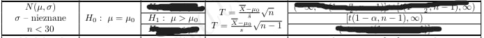
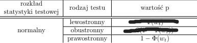
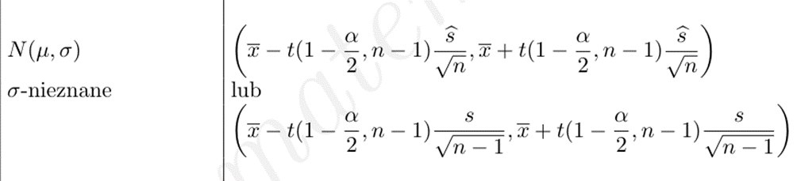
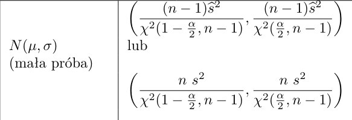

```{r setup, include=FALSE}
knitr::opts_chunk$set(echo = TRUE)
```

```{r message=FALSE, warning=FALSE}
library(stats)
```

## Zadanie 1
Czas montowania elementu T w automatycznej pralce bębenkowej jest zmienną losową o rozkładzie normalnym.
Norma techniczna przewiduje na tę czynność 6 minut. Natomiast wśród monterów panuje pogląd, że ten czas
jest zbyt krótki. Aby sprawdzić ten pogląd zmierzono czas montowania w grupie 25 monterów i otrzymano
średnią równą 6 minut 20 sekund oraz obciążone odchylenie standardowe równe 1 minutę i 30 sekund.

(A) Zakładając, że czas montowania elementu T ma rozkład normalny, na poziomie istotności 0.02 dokonaj
weryfikacji odpowiedniej hipotezy. Decyzje podejmij na podstawie odpowiednio zbudowanego obszaru
krytycznego.
(B) Zakładając, że czas montowania elementu T ma rozkład normalny, na poziomie istotności 0.02 dokonaj
weryfikacji odpowiedniej hipotezy. Decyzje podejmij na podstawie wartości p.
(C) Czy decyzja z punktu (A) ulegnie zmianie jeśli poziom istotności zwiększymy dwukrotnie? Uzasadnij
dlaczego?
(D) Czy decyzja z punktu (A) ulegnie zmianie jeśli poziom istotności zmniejszymy dwukrotnie? Uzasadnij
dlaczego?
(E) Zbuduj 98% przedział ufności dla średniego czasu montowania elementu T w automatycznej pralce
bębenkowej.
(F) Zbuduj 98% przedział ufności dla wariancji czasu montowania elementu T w automatycznej pralce
bębenkowej.

```{r}
h0 <- 6
srednia <- 6+1/3
n = 25
s = 1.5
```

$H_0:\mu = 6$
$H_1:\mu > 6$
Mamy więc test prawostronny
### (A)

```{r}
a = 0.02
```

```{r}
t = ((srednia - h0)/s) * sqrt(n - 1) #statystyka
t
```

```{r}
qt(1 - a, n - 1) #obszar krytyczny
```
Obszar krytyczny: $[2.171,\infty)$

Wartość statystyki nie zawiera się w obszarze krytycznym a więc nie mamy podstaw do odrzucenia $H_0$.

### (B)

```{r}
1 - pt(t,n-1)
#Otrzylem wartość p równą 0.1435573.Wartość p jest mniejsza od 0.2, a więc nie mamy podstaw do odrzucenia H0.
#Nie mamy podstaw do odrzucenia H0, ponieważ 0.144<0.2
#dla tego że ta statystyka testowa ma rozkład t-Studenta z n-1 wzorami
```
###(C)
```{r}
a_c=0.02*2
```

```{r}
t = (srednia - h0)/s * sqrt(n - 1) #statystyka
t
```

```{r}
qt(1 - a_c, n - 1) #obszar krytyczny
```

Obszar krytyczny: $[1.828051,\infty)$

Wartość statystyki nie zawiera się w obszarze krytycznym a więc nie mamy podstaw do odrzucenia $H_0$.

###(D)
```{r}
a_d <- 0.02/2
```

```{r}
qt(1 - a_d, n - 1)

```
Obszar krytyczny: $[2.492159,\infty)$

Statystyki nie ma w obszarze krytycznym a więc nie mamy podstaw do odrzucenia $H_0$.!
Wartość statystyki nie zawiera się w obszarze krytycznym a więc nie mamy podstaw do odrzucenia $H_0$.!
Widzimy że w tym przypadku nastąpiło przesuniencie w prawo lewego końca

**(E)**

```{r}
srednia <- 6+1/3
n = 25
s = 1.5
alfa <- 1-0.98
t.alfa <- qt(1-alfa/2,n-1)
l.koniec <- round(srednia - t.alfa*s/sqrt(n-1),3)
p.koniec <- round(srednia + t.alfa*s/sqrt(n-1),3)
# cat("Na poziomie istotności 0.98 nieznana wartość średniego czasu montowania elementu T w automatycznej pralce bębenkowej pokrywa przedział: (",l.koniec,",",p.koniec,")")

cat("Około 98 realizacji przedziału: (",l.koniec,",",p.koniec,"), na 100 zawiera szacowana wartość średniego czasu montowania elementu T w automatycznej pralce bębenkowej.")


```

**(F)**


```{r}
srednia <- 6 + 1/3
n = 25
s = 1.5
alfa <- 1 - 0.98
x.2_l <- qchisq(1-alfa/2,n-1)
x.2_p <- qchisq(alfa/2,n-1)
l.koniec <- round(n*s/x.2_l,3)
p.koniec <- round(n*s/x.2_p,3)
cat("Na poziomie istotności 0.98 nieznana wartość wariancji czasu montowania elementu T w automatycznej pralce bębenkowej pokrywa przedział: (",l.koniec,",",p.koniec,")")
```

