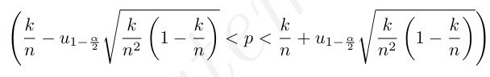
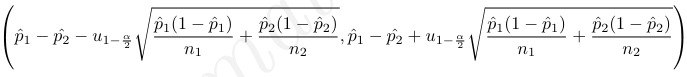
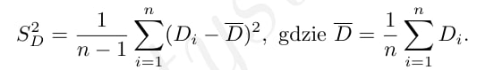
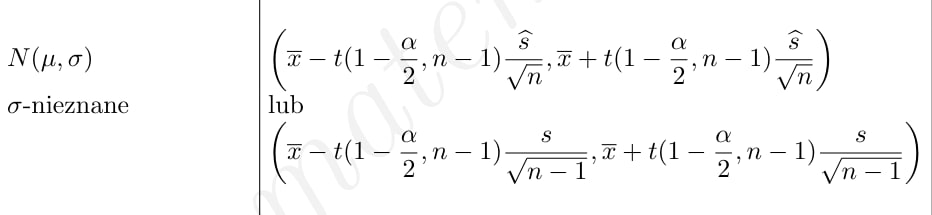
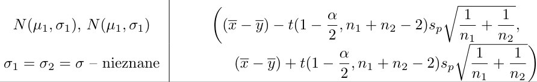
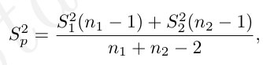
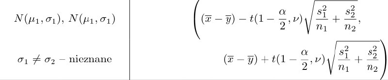
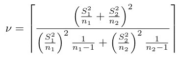

```{r setup, include=FALSE}
knitr::opts_chunk$set(echo = TRUE)
```
ZADANIE 8.1
Wysunięto przypuszczenie, że palenie tytoniu może powodować powstawanie zmarszczek
na skórze wokół oczu. Zbadano, więc 150 palaczy i 250 osób niepalących i stwierdzono, że u 95 palaczy i
105 osób niepalących zaobserwowano widoczne zmarszczki wokół oczu (na podstawie standardowej oceny
zmarszczek przeprowadzonej przez osobę, która nie wiedziała, czy badana osoba jest paląca, czy nie).
(A) Napisz funkcję programu R za pomocą której można zbudować przedział ufności dla frakcji.<br>

```{r}
#A
przedzial_frakcji <- function(k,n,alfa){
a <- 1-alfa
u.a <- qnorm(1-a/2)
frak <- k/n
l.koniec <- round(frak-u.a*sqrt(frak*(1-frak)/n),3)
p.koniec <- round(frak+u.a*sqrt(frak*(1-frak)/n),3)
przedzial <- paste('(',l.koniec,',',p.koniec,')')
return(przedzial)
}
```
(B) Korzystając ze budowanej funkcji w punkcie (A) zbuduj przedziały ufności dla frakcji osób posiadających zmarszczki wokół oczu w przypadku osób palących i niepalących. Przyjmij poziom ufności 0.95. Czy na podstawie zbudowanych przedziałów możesz sformułować jakieś wnioski?
```{r}
#B
cat("Przedział ufności dla frakcji osób ze zmarszczkami wokół oczu wśród palących",przedzial_frakcji(95,150,0.95))
cat("\nPrzedział ufności dla frakcji osób ze zmarszczkami wokół oczu wśród niepalących",przedzial_frakcji(105,250,0.95),"\n")
print("Zauważmy, że otrzymane przedziały są rozłączne. Wobec tego, możemy przypuszczać, że na podstawie
otrzymanych prób oraz na poziomie istotności 0.95, istnieje różnica między osobami palącymi tytoń i
niepalącymi w kontekście posiadania zmarszczek wokół oczu")

```
(C) Aby stwierdzić czy palenie tytoniu może powodować powstawanie zmarszczek na skórze wokół oczu zbuduj 95% przedział ufności dla różnicy frakcji osób ze zmarszczkami wokół oczu wśród palących i niepalących. Jaki wniosek możesz sformułować na podstawie otrzymanego przedziału?<br>

```{r}
#C
p1 <- 95/150
n1 <- 150
p2 <- 105/250
n2 <- 250
a <- 1-0.95
u.a <- qnorm(1-a/2)
l.koniec <- round(p1-p2-u.a*sqrt(p1*(1-p1)/n1+p2*(1-p2)/n2),3)
p.koniec <- round(p1-p2+u.a*sqrt(p1*(1-p1)/n1+p2*(1-p2)/n2),3)
cat("Przedział ufności: (",l.koniec,",",p.koniec,")\n")
print("Otrzymany przedział ufności nie pokrywa zera, co oznacza, że istnieje istotna różnica między osobami
palącymi i niepalącymi, na poziomie ufności 0.95 i na podstawie otrzymanych prób. Ponadto widzimy, że oba
końce przedziału są dodatnie, co może świadczyć o tym, że p1 > p2, czyli frakcja osób palących posiadających
zmarszczki wokół oczu jest większa.")
```
ZADANIE 8.2. Na laboratorium nr 3 rozważaliśmy zbiór danych stenzenieolowiu. W zbiorze znajdują się
dwie zmienne: stężenie ołowiu w wodzie znane i zmierzone. Na podstawie tych danych chcemy stwierdzić,
czy metoda, którą dokonano pomiarów jest dobrze wyskalowana.
Na poziomie ufności 0.95 zbuduj przedział ufności dla różnicy średnich stężeń znanego i zmierzonego, a
następnie na podstawie otrzymanego przedziału odpowiedz na pytanie, czy rozważana metoda jest dobrze
wyskalowana. Obliczeń dokonaj korzystając z odpowiednich wzorów podanych na wykładzie, a następnie za
pomocą funkcji stats::t.test().<br>

<br>

```{r}
library(readxl)
dane2 <- read_excel("stezenieolowiu.xlsx")
zmierzone <-  dane2$zmierzone 
znane <-  dane2$znane
n <- length(zmierzone)

Di <- znane - zmierzone
srednia <- mean(Di)
Sd <- sd(Di)
alpha <- 1 - 0.95
t.alpha <- qt(1-alpha/2,n-1)

l.koniec <- round(srednia-t.alpha*Sd/sqrt(n),3)
p.koniec <- round(srednia+t.alpha*Sd/sqrt(n),3)
cat("Przedział :(",l.koniec,",",p.koniec,")","\nPrzedział zawiera 0 a więc różnica jest nieistotna i to oznacza, że metoda jest poprawna.")
```
```{r}
t.test(Di)
print("Z wykorzystaniem funkcji t.test() wyniki wyszedłi te same.")
```

ZADANIE 8.3. W celu porównania zawartości kalorii w hot-dogach wołowych i drobiowych zmierzono
zawartość kalorii w 20 hot-dogach wołowych i 17 drobiowych. Wyniki zapisano w zbiorze hot_dog udostępnionym na Teamsach. Zakładając, że dane pochodzą z populacji o rozkładach normalnych, na poziomie ufności 0.98 zbuduj przedział ufności dla różnicy średniej zawartości kalorii w rozważanych hot-dogach.
Obliczeń dokonaj korzystając z odpowiednich wzorów podanych na wykładzie w dwóch przypadkach
```{r message=TRUE, warning=FALSE}
library(readxl)
dane3 <- read_excel("hot_dog.xlsx")
wolowe <- dane3$wołowe
drobiowe <- na.omit(dane3$drobiowe)
n1 <- 20
n2 <- 17
srednia1 <- mean(wolowe)
srednia2 <- mean(drobiowe)
s1.2 <- var(wolowe)
s2.2 <- var(drobiowe)
alfa <- 1-0.98
```
*zakładając, że odchylenia standardowe rozkładów kalorii w rozważanych hot-dogach są równe<br>


```{r}
sp <- sqrt((s1.2*(n1-1)+s2.2*(n2-1))/(n1+n2-2))
sp
t.alfa <- qt(1-alfa/2,n1+n2-2)
l.koniec <- round((srednia1-srednia2)-t.alfa*sp*sqrt((1/n1)+(1/n2)),3)
p.koniec <- round((srednia1-srednia2)+t.alfa*sp*sqrt((1/n1)+(1/n2)),3)
cat("Przedział: (",l.koniec,",",p.koniec,")")
```

*zakładając, że odchylenie standardowe rozkładów kalorii rozważanych hot-dogach są różne.<br>


```{r}
k1 <- s1.2/n1
k2 <- s2.2/n2
licznik <- (k1+k2)^2
mianownik <- k1^2/(n1-1)+k2^2/(n2-1)
v= ceiling(licznik/mianownik)
t.alfa <- qt(1-alfa/2,v)
l.koniec <- round((srednia1-srednia2)-t.alfa*sqrt(k1+k2),3)
p.koniec <- round((srednia1-srednia2)+t.alfa*sqrt(k1+k2),3)
cat("Przedział: (",l.koniec,",",p.koniec,")")
```


